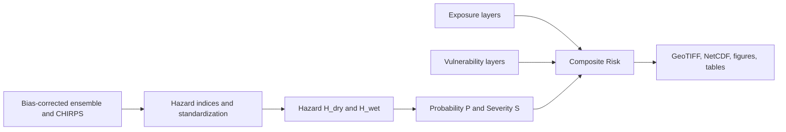

# Hydroclimatic Risk Mapping - Ethiopia

This documentation presents a reproducible, config-driven pipeline for seasonal
hydroclimatic risk mapping over Ethiopia using the IPCC-aligned framework:

$$
R = H \times E \times V
$$

where:
- $H$ is hazard (drought or excess wetness)
- $E$ is exposure (people, cropland, livestock, infrastructure)
- $V$ is vulnerability

<section class="hero">
  

    
Seasonal Forecast Analytics

    <h2 class="hero-title">From Ensemble Rainfall Forecasts To Actionable Risk Maps</h2>
    

      A country-scale risk-screening workflow for Ethiopia that combines hazard,
      exposure, and vulnerability into interpretable outputs for planning,
      preparedness, and communication.
    

  

</section>

## What you can do with this documentation

  <a class="tool-card" href="docs/hazards.html">
    <h3>Hazards</h3>
    
Inspect drought and excess-wetness hazard construction and JJAS hazard products.

  </a>
  <a class="tool-card" href="docs/exposure.html">
    <h3>Exposure</h3>
    
Review sectoral exposure layers with notebook-based raw and derived inspections.

  </a>
  <a class="tool-card" href="docs/vulnerability.html">
    <h3>Vulnerability</h3>
    
Explore drought and wetness vulnerability composition and supporting indicators.

  </a>
  <a class="tool-card" href="docs/results_gallery.html">
    <h3>Results Gallery</h3>
    
View representative hazard, probability, severity, and risk map outputs.

  </a>

## Documentation map

  <a class="doc-pill" href="docs/methodology.html">Methodology</a>
  <a class="doc-pill" href="docs/data_provenance.html">Data Provenance</a>
  <a class="doc-pill" href="docs/reproducibility.html">Reproducibility</a>
  <a class="doc-pill" href="inspect_exposure_geotiffs.html">Exposure GeoTIFF Notebook</a>
  <a class="doc-pill" href="inspect_exposure_vulnerability_raw_sources.html">Raw Source Notebook</a>

## Pipeline at a glance

## What this site includes

- Conceptual and quantitative methodology used by the pipeline
- Data lineage and licensing details for all core inputs
- Generated map outputs for drought and excess wetness risk
- Notebook-based inspection workflows
- Reproducibility instructions for local and CI builds

