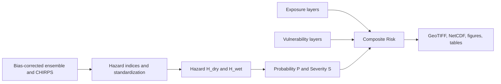

# Hydroclimatic Risk Mapping - Ethiopia

This documentation presents a reproducible, config-driven pipeline for seasonal
hydroclimatic risk mapping over Ethiopia using the IPCC-aligned framework:

$$
R = H \times E \times V
$$

where:
- $H$ is hazard (drought or excess wetness)
- $E$ is exposure (people, cropland, livestock, infrastructure)
- $V$ is vulnerability

  <a class="home-card" href="docs/hazards.html">
    <h3>Hazards</h3>
    
Drought and excess-wetness hazard surfaces and interpretation.

  </a>
  <a class="home-card" href="docs/exposure.html">
    <h3>Exposure</h3>
    
Sectoral exposure layers with notebook-based inspection references.

  </a>
  <a class="home-card" href="docs/vulnerability.html">
    <h3>Vulnerability</h3>
    
Composite vulnerability structure and raw/derived input references.

  </a>
  <a class="home-card" href="docs/methodology.html">
    <h3>Methodology</h3>
    
Formulas, standardization, weights, and hazard-probability logic.

  </a>
  <a class="home-card" href="docs/data_provenance.html">
    <h3>Data Provenance</h3>
    
Source-by-source inventory with licenses, caveats, and exclusions.

  </a>
  <a class="home-card" href="docs/results_gallery.html">
    <h3>Results Gallery</h3>
    
JJAS hazard, probability, severity, vulnerability, and risk maps.

  </a>
  <a class="home-card" href="docs/reproducibility.html">
    <h3>Reproducibility</h3>
    
Environment setup, local docs build, and GitHub Pages publication.

  </a>

## Pipeline at a glance

## What this site includes

- Conceptual and quantitative methodology used by the pipeline
- Data lineage and licensing details for all core inputs
- Generated map outputs for drought and excess wetness risk
- Notebook-based inspection workflows
- Reproducibility instructions for local and CI builds

