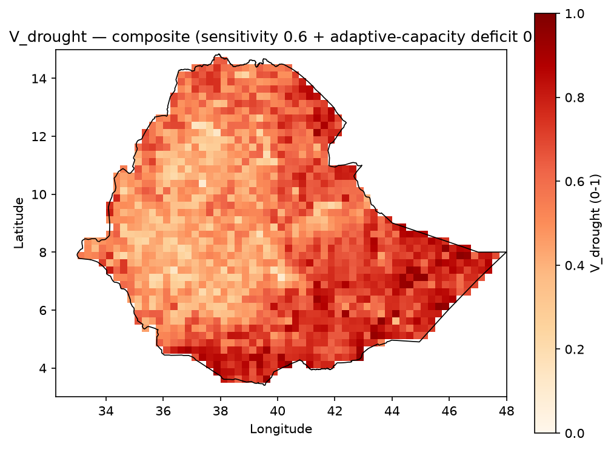
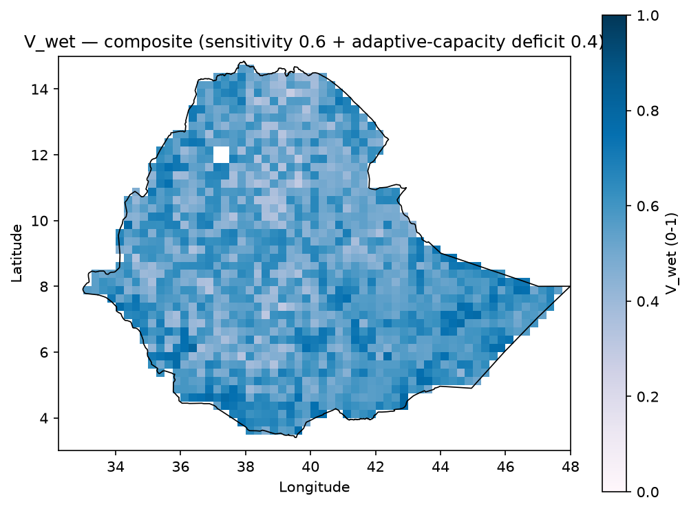

# Vulnerability

Vulnerability determines *how much harm* a given exposure suffers once a
hazard occurs. It is the third term in the pipeline's IPCC-aligned framework,
$R = H \times E \times V$.

```{admonition} Definition
:class: note
Vulnerability is "the conditions determined by physical, social, economic and
environmental factors or processes which increase the susceptibility of an
individual, a community, assets or systems to the impacts of hazards"
(UNDRR, 2019). In this pipeline, vulnerability combines sensitivity (how
exposed livelihoods are to a given hazard type) and adaptive-capacity deficit
(how limited the means to cope or recover are).
```

## In this pipeline

- `V_drought` -- drought vulnerability
- `V_wet` -- excess-wetness vulnerability

Both are composite indices, normalized 0-1 on the same analysis grid as hazard
and exposure, where higher values indicate higher vulnerability:

```
V = 0.6 x sensitivity + 0.4 x adaptive_capacity_deficit
```

## Vulnerability sub-indicators and data sources

| Sub-indicator | Feeds | Source | License |
|---|---|---|---|
| Relative wealth index | Sensitivity (both) | Meta Data for Good | CC-BY 4.0 |
| Irrigated area percent | Adaptive capacity (drought) | FAO GMIA v5 | CC-BY 4.0 |
| Aridity index | Sensitivity (drought) | CGIAR-CSI / Global Aridity Index v3 | CC-BY 4.0 |
| Population without electricity access | Adaptive capacity (both) | IIASA/GDESSA | CC-BY 4.0 |
| Elevation and slope | Sensitivity (wet) | NOAA ETOPO 2022 | Public domain |
| Topsoil clay content | Sensitivity (wet, drainage) | ISRIC SoilGrids 2.0 | CC-BY 4.0 |
| Distance to rivers/water bodies | Sensitivity (wet) | OpenStreetMap (via Geofabrik) | ODbL |

Full citations, acquisition modules, and output file names are in
[data_provenance.md](data_provenance.md).

## Layer statistics

Composite indices, computed on the analysis grid (post country-mask):

| Layer | Valid cells | Min | Mean | Max |
|---|---|---|---|---|
| V_drought (0-1) | 1,489 / 2,880 | 0.09 | 0.58 | 0.97 |
| V_wet (0-1) | 1,485 / 2,880 | 0.28 | 0.56 | 0.81 |

Raw sub-indicators (domain grid, before the final country-boundary mask):

| Sub-indicator | Min | Mean | Max |
|---|---|---|---|
| Relative wealth index | -1.16 | -0.46 | 0.17 |
| Irrigated area (%) | 0.0 | 0.7 | 88.0 |
| Aridity index | 0.00 | 0.34 | 1.47 |
| Population w/o electricity access | 766 | 58,451 | 2,599,120 |
| Slope (degrees) | 0.0 | 2.1 | 20.4 |
| Topsoil clay content (%) | 12.5 | 32.0 | 62.8 |
| Distance to river/water body (km) | 0.0 | 74.5 | 636.6 |

## Representative figures

| V_drought | V_wet |
|---|---|
|  |  |

*Composite vulnerability, normalized 0-1, Ethiopia-clipped.*

## Inspect the full layers

Two notebooks carry the complete, machine-readable detail behind this page.
Both are also listed in the left sidebar under this Vulnerability page (and
under the Exposure page, since they cover both components).

```{admonition} Exposure and vulnerability GeoTIFF notebook
:class: seealso
[inspect_exposure_geotiffs.html](../inspect_exposure_geotiffs.html) -- V_drought
and V_wet maps, component interpretation notes, summary statistics, and
boundary-clipped previews.
```

```{admonition} Raw source inspection notebook
:class: seealso
[inspect_exposure_vulnerability_raw_sources.html](../inspect_exposure_vulnerability_raw_sources.html)
-- native inputs (aridity, irrigation, electrification access, waterways and
water bodies, relative wealth index) prior to resampling.
```

## Related documentation

- Method formulas and composition: [methodology.md](methodology.md)
- Source licensing and caveats: [data_provenance.md](data_provenance.md)
- Hazard component: [hazards.md](hazards.md)
- Exposure component: [exposure.md](exposure.md)
